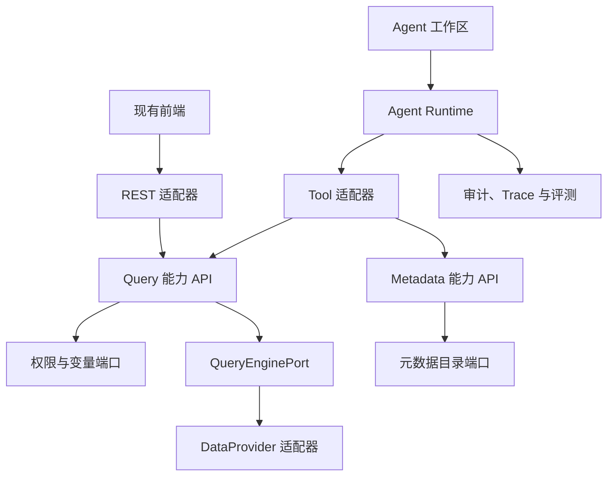

# YuBi Agent-ready 架构改造计划

## 1. 目标与边界

YuBi 后续将逐步引入 AI 和 Agent 能力。本计划不以一次性重写为目标，而是先把现有查询、元数据、权限和可视化能力整理为稳定的业务能力接口，再让 Agent 通过受控工具调用这些接口。

已确认的基本决策：

- 保持 Maven 多模块单体和单体部署，不拆微服务。
- 首个能力切片是查询执行，后续再扩展元数据、可视化和写操作。
- `query` 模块不依赖 `core`、`security`、`server`、Spring MVC、MyBatis 或具体 DataProvider 实现。
- Agent 不直接访问 Controller、Mapper、数据库、数据源配置或 Provider 实现。
- 项目当前没有生产用户或已知外部调用方，REST 接口可以在仓库内原子迁移后直接清理，不设置发布版本兼容窗口。
- 数据库结构、已保存的 View/Dashboard 配置和 DataProvider SPI 保持兼容。
- Agent V1 只允许查询已有 View，不接受任意 SQL，不提供写操作。

本计划不包含模型选型、提示词设计或多 Agent 协作。这些决策应在查询和元数据能力稳定后单独完成。

## 2. 目标架构



### 2.1 Query 模块边界

`query` 模块只包含纯 Java API、应用服务、领域值对象和端口：

- `ExecuteQueryUseCase`：执行已有 View。
- `PreviewQueryUseCase`：服务现有数据视图编辑器，不暴露为 Agent V1 工具。
- `QueryDefinitionPort`：读取 View 和 Source 的只读投影。
- `QueryAccessPolicyPort`：解析用户、组织、视图和列权限，并决定脚本是否可见。
- `QueryVariablePort`：解析系统、组织、View 和请求变量。
- `QueryEnginePort`：隔离现有 `DataProviderManager`。
- `QueryAuditPort`：记录调用来源、耗时、结果规模和失败状态。

Mapper 查询、Spring Security 上下文、AES 解密、Jackson 配置解析以及现有 Provider DTO 转换由 `server` 中的适配器承担。`query` 不暴露 MyBatis 实体或 `yubi.core.data.provider` 类型。

### 2.2 查询契约

新 REST 入口统一为：

- `POST /api/v1/queries/execute`
- `POST /api/v1/queries/preview`
- `POST /api/v1/public/queries/execute`

公共查询使用 `X-YuBi-Share-Token` 请求头。分享页面 URL 仍只负责加载前端应用，页面 JavaScript 再携带请求头调用公共查询接口。

`ExecuteQueryCommand` 只保留查询实际需要的 View、选择列、聚合、过滤、分组、排序、分页、变量和执行选项。规范字段使用 `concurrencyControlMode`；当前未生效的旧字段 `concurrencyControlModel` 不进入 Agent Tool Schema。

`QueryResult` 返回列元数据、数据行、分页信息和按权限决定是否返回的脚本。用户、组织和权限上下文由服务端认证会话生成，不允许客户端或模型覆盖。

### 2.3 Agent V1 工具

首版只读 Agent 只注册以下工具：

- `search_data_assets`：搜索当前用户可见的数据资产。
- `describe_data_asset`：读取指定 View 的字段、类型和业务描述。
- `execute_view`：通过结构化参数执行已有 View。

任何创建、修改、发布、分享或删除能力均不属于 Agent V1。

## 3. 阶段性独立目标

每个目标必须在独立任务中完成。一个目标未满足退出条件时，不进入下一目标，也不顺带实施后续阶段。

### 目标 A：架构基线与行为特征测试

**状态**：已完成（2026-07-12）

**目的**：在移动查询逻辑前锁定现有行为和安全语义。

**工作内容**：

- 完成架构审查、Query ADR、当前与目标依赖图。
- 为登录查询、分享查询、变量解析、列权限、分页归一化、脚本隐藏和 Provider 异常建立特征测试。
- 记录当前 REST 请求和响应样例，确认哪些字段实际生效。
- 明确持久化配置兼容样例，尤其是 View 和 Dashboard 查询配置。

**退出条件**：

- 特征测试在未重构代码上通过。
- 文档能够解释查询请求从 Controller 到 Provider 的完整数据流。
- 无尚未决定的 Query 模块依赖方向或公开契约。

**完成记录**：

- 架构审查：`docs/architecture/query-current-state-review.md`
- Query ADR：`docs/architecture/adr/0001-query-capability-boundary.md`
- 新增 8 个特征测试，覆盖登录与预览查询、分享令牌、变量、列权限、Owner 规则、分页、脚本隐藏和 Provider 异常。
- `mvn -pl server -am -Dexec.skip=true test`：通过；server 19 项测试通过，reactor 全部成功。
- Query 定向测试：8 项通过。
- `npm run checkTs`、`npm run lint`：通过。
- `npm run test:ci`：201 个测试文件通过，1319 项测试通过，4 项跳过；其中 View 配置迁移与请求构建定向测试 3 个文件、38 项通过。
- `mvn -pl server -am -DskipTests package`：通过；前端主应用/task、后端 Jar 和安装包 assembly 均成功。
- 已知非阻断告警：Mockito 动态 agent、测试环境 Log4j provider、Vite 大 chunk、AntV S2 缺失 sourcemap 提示；前端迁移异常输出来自错误分支测试预期。均未通过放宽测试处理。
- 本目标未修改生产代码，未创建 `query` 模块，未进入目标 B。

### 目标 B：后端 Query 能力模块

**依赖**：目标 A。

**目的**：建立与框架和基础设施解耦的查询应用能力，暂不改变前端调用路径。

**工作内容**：

- 新增纯 Java `query` Maven 模块及 Use Case、命令、结果和端口。
- 在 `server` 实现查询定义、权限、变量、审计和 Provider 适配器。
- 将 `DataProviderServiceImpl` 中的查询编排迁入 Query 应用服务；数据源元数据、连接测试等非查询职责暂时保留。
- 旧 Controller 暂时委托新 Use Case，保证阶段结束时现有前端仍可运行。
- 增加模块依赖测试，禁止 `query` 依赖 `core/security/server` 和框架实现。

**退出条件**：

- 原查询特征测试全部通过。
- `query` 的 Maven 依赖树不包含 Spring MVC、MyBatis、Security 或 Provider 实现。
- `DataProviderServiceImpl` 不再负责变量、列权限、分页和执行编排。

### 目标 C：新 REST 契约与前端 Query Feature

**依赖**：目标 B。

**目的**：让现有产品界面统一通过 Query 能力接口访问查询服务。

**工作内容**：

- 增加三个新查询入口和 `X-YuBi-Share-Token` 处理。
- 新建前端 `features/query`，集中查询契约、客户端和请求构建逻辑。
- 页面 thunk 继续负责页面状态编排，只把 HTTP 调用和纯请求构建移入 feature。
- 逐批迁移 ChartWorkbench、Dashboard、Viz 和 Share 调用点。
- 迁移期间旧 `app/models`、`app/types` 路径可临时 re-export；目标结束前允许保留，避免把目录迁移与调用迁移混成一次大改。
- 验证普通分享链接、应用内分享 iframe 和跨域预检场景。

**退出条件**：

- 仓库内前端不再调用三个旧 REST 入口。
- 所有查询调用通过 `features/query` 客户端发送。
- 分享查询只通过请求头发送执行令牌。
- 前端类型检查、查询单测、分享页面测试和构建通过。

### 目标 D：旧接口与过渡代码清理

**依赖**：目标 C。

**目的**：在无外部用户的前提下完成原子迁移收尾，不长期维护双实现。

**工作内容**：

- 删除 `/data-provider/execute`、`/data-provider/execute/test` 和 `/shares/execute`。
- 删除旧 Controller 查询方法、旧请求 DTO、查询参数令牌逻辑和临时前端 re-export。
- 删除 `concurrencyControlModel` 拼写，统一为 `concurrencyControlMode`；持久化配置仍保持现有 `concurrencyControlMode` 格式。
- 增加前端导入规则：shared/feature 不得导入 `app/pages/*`，页面不得直接导入其他页面的查询 thunk。
- 全仓搜索确认旧路径、旧字段和旧类型引用归零。

**退出条件**：

- 旧接口返回 404，仓库内无旧路径和 `concurrencyControlModel` 引用。
- View/Dashboard 历史配置兼容测试通过。
- 完整产品查询、分享和下载回归通过。

### 目标 E：元数据与语义能力

**依赖**：目标 D。

**目的**：让 Agent 在查询前能够发现和理解有权限的数据资产。

**工作内容**：

- 建立 `QueryMetadataUseCase` 及搜索、详情和字段描述契约。
- 返回权限过滤后的 View、字段、数据类型、变量和可用函数。
- 不向 Agent 返回数据源密码、连接串、原始加密配置或无管理权限时的脚本。
- 为元数据搜索和描述建立稳定 Tool Schema。

**退出条件**：

- 不同组织、角色和列权限下的元数据结果符合现有授权模型。
- 搜索和详情接口不依赖 Agent Runtime 或具体模型 SDK。

### 目标 F：只读 Agent Runtime

**依赖**：目标 E。

**目的**：在不开放任意 SQL 和写操作的前提下完成第一条端到端 Agent 数据分析链路。

**工作内容**：

- 新增独立 `agent` 模块，包含 Model Gateway、会话、Tool Registry、步骤执行和失败处理。
- 注册 `search_data_assets`、`describe_data_asset`、`execute_view`。
- Tool 适配器直接调用能力 API，不通过 REST，也不访问 Mapper 或 Provider。
- 从认证上下文注入用户和组织，拒绝模型传入的身份覆盖字段。
- 记录会话、请求、用户、组织、工具、脱敏参数摘要、耗时、结果规模和状态。

**退出条件**：

- 使用假模型可重复验证工具选择、权限拒绝、失败恢复和结果截断。
- Agent 无法执行任意 SQL、访问未授权字段或调用写操作。
- 领域模块和 Query 模块不依赖任何模型 SDK。

### 目标 G：评测、可观测与安全加固

**依赖**：目标 F。

**目的**：在扩展 Agent 能力前建立可量化的质量和运行风险基线。

**工作内容**：

- 建立离线评测集，覆盖资产发现、查询参数生成、拒答和越权尝试。
- 增加 Tool 调用 Trace、延迟、失败率、查询行数和资源消耗指标。
- 配置查询分页、超时、并发和结果截断策略。
- 验证日志不包含令牌、数据源配置、密码或未授权数据。

**退出条件**：

- 评测可在 CI 或受控环境中重复运行。
- 每次 Agent 查询都能追踪到具体用户、工具调用和最终结果。
- 安全测试覆盖提示注入、身份伪造和超限查询。

### 目标 H：受控写工具与 Agent 工作区

**依赖**：目标 G。

**目的**：在只读链路稳定后逐步开放创建图表、修改仪表盘等高价值操作。

**工作内容**：

- 每类写能力先抽取独立业务 Use Case，再注册为 Agent Tool。
- 所有写工具必须支持显式审批、参数预览、幂等键、审计和失败回滚。
- 前端 Agent 工作区展示计划、工具执行、数据结果、待审批操作和失败信息。
- 删除、发布、分享等高风险动作单独评审，不随首批写工具默认开放。

**退出条件**：

- 未审批的写操作不会产生业务副作用。
- 重复提交不会创建重复资源。
- 用户可以查看并追溯 Agent 的每次业务变更。

## 4. 验证基线

阶段目标按影响范围执行验证，不能用后续阶段测试替代当前阶段的退出条件。

后端基础验证：

```bash
mvn -pl server -am -Dexec.skip=true test
mvn -pl server -am -DskipTests package
```

目标 B 创建 `query` 模块后，所有后续目标额外执行：

```bash
mvn -pl query -am test
```

前端基础验证：

```bash
cd frontend
npm run checkTs
npm run lint
npm run test:ci
npm run build:task
npm run build
```

发布链路继续执行现有构建体积检查、JDBC 定向测试和 `scripts/check-demo-health.sh`。如果新增架构规则进入 ESLint，CI 必须显式执行 `npm run lint`，不能只运行现有 Stylelint 步骤。

## 5. 执行约束

- 每次只启动一个阶段目标，并将目标名称写入任务描述。
- 每个目标必须从干净工作区开始，以对应退出条件结束。
- 不在 Query 重构中顺带实现 Agent Runtime，也不在 Agent Runtime 中回头重写 Query 边界。
- 不为了消除编译错误让 `query` 直接依赖 `core` 或 `server`。
- 不把模型生成内容直接视为已授权命令；权限和审批始终由确定性代码执行。
- 验证失败时记录真实原因，不删除测试或放宽权限规则来获得通过。
