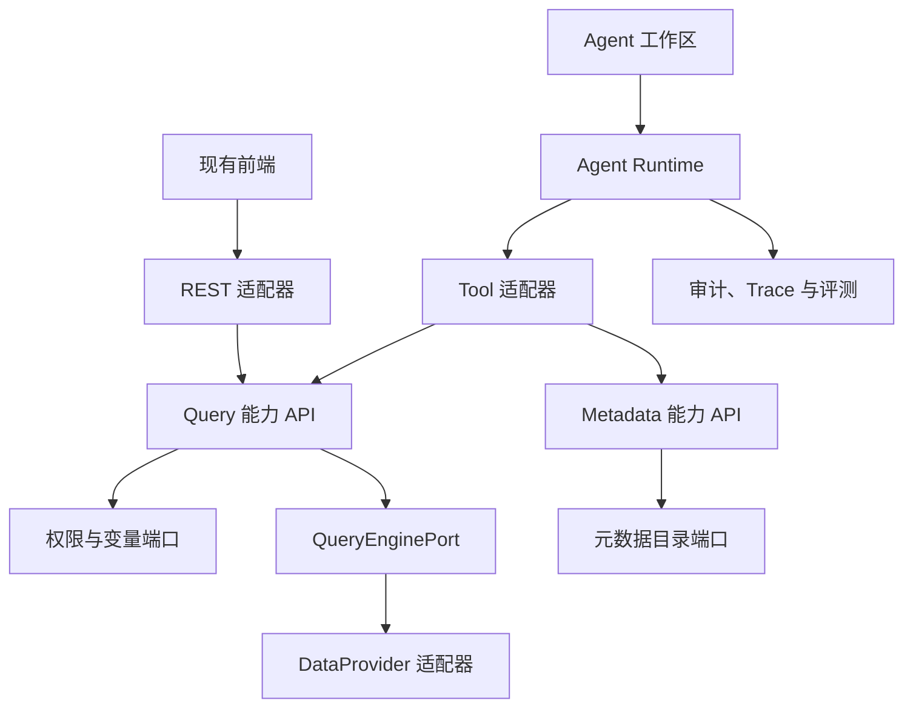

# YuBi Agent-ready 架构改造计划

## 1. 目标与边界

YuBi 后续将逐步引入 AI 和 Agent 能力。本计划不以一次性重写为目标，而是先把现有查询、元数据、权限和可视化能力整理为稳定的业务能力接口，再让 Agent 通过受控工具调用这些接口。

已确认的基本决策：

- 保持 Maven 多模块单体和单体部署，不拆微服务。
- 首个能力切片是查询执行，后续再扩展元数据、可视化和写操作。
- `query` 模块不依赖 `core`、`security`、`server`、Spring MVC、MyBatis 或具体 DataProvider 实现。
- Agent 不直接访问 Controller、Mapper、数据库、数据源配置或 Provider 实现。
- 项目当前没有生产用户或已知外部调用方，REST 接口可以在仓库内原子迁移后直接清理，不设置发布版本兼容窗口。
- 数据库结构、已保存的 View/Dashboard 配置和 DataProvider SPI 保持兼容。
- Agent V1 只允许查询已有 View，不接受任意 SQL，不提供写操作。

本计划不包含模型选型、提示词设计或多 Agent 协作。这些决策应在查询和元数据能力稳定后单独完成。

## 2. 目标架构



### 2.1 Query 模块边界

`query` 模块只包含纯 Java API、应用服务、领域值对象和端口：

- `ExecuteQueryUseCase`：执行已有 View。
- `PreviewQueryUseCase`：服务现有数据视图编辑器，不暴露为 Agent V1 工具。
- `QueryDefinitionPort`：读取 View 和 Source 的只读投影。
- `QueryAccessPolicyPort`：解析用户、组织、视图和列权限，并决定脚本是否可见。
- `QueryVariablePort`：解析系统、组织、View 和请求变量。
- `QueryEnginePort`：隔离现有 `DataProviderManager`。
- `QueryAuditPort`：记录调用来源、耗时、结果规模和失败状态。

Mapper 查询、Spring Security 上下文、AES 解密、Jackson 配置解析以及现有 Provider DTO 转换由 `server` 中的适配器承担。`query` 不暴露 MyBatis 实体或 `yubi.core.data.provider` 类型。

### 2.2 查询契约

新 REST 入口统一为：

- `POST /api/v1/queries/execute`
- `POST /api/v1/queries/preview`
- `POST /api/v1/public/queries/execute`

公共查询使用 `X-YuBi-Share-Token` 请求头。分享页面 URL 仍只负责加载前端应用，页面 JavaScript 再携带请求头调用公共查询接口。

`ExecuteQueryCommand` 只保留查询实际需要的 View、选择列、聚合、过滤、分组、排序、分页、变量和执行选项。规范字段使用 `concurrencyControlMode`；当前未生效的旧字段 `concurrencyControlModel` 不进入 Agent Tool Schema。

`QueryResult` 返回列元数据、数据行、分页信息和按权限决定是否返回的脚本。用户、组织和权限上下文由服务端认证会话生成，不允许客户端或模型覆盖。

### 2.3 Agent V1 工具

首版只读 Agent 只注册以下工具：

- `search_data_assets`：搜索当前用户可见的数据资产。
- `describe_data_asset`：读取指定 View 的字段、类型和业务描述。
- `execute_view`：通过结构化参数执行已有 View。

任何创建、修改、发布、分享或删除能力均不属于 Agent V1。

## 3. 阶段性独立目标

每个目标必须在独立任务中完成。一个目标未满足退出条件时，不进入下一目标，也不顺带实施后续阶段。

### 目标 A：架构基线与行为特征测试

**状态**：已完成（2026-07-12）

**目的**：在移动查询逻辑前锁定现有行为和安全语义。

**工作内容**：

- 完成架构审查、Query ADR、当前与目标依赖图。
- 为登录查询、分享查询、变量解析、列权限、分页归一化、脚本隐藏和 Provider 异常建立特征测试。
- 记录当前 REST 请求和响应样例，确认哪些字段实际生效。
- 明确持久化配置兼容样例，尤其是 View 和 Dashboard 查询配置。

**退出条件**：

- 特征测试在未重构代码上通过。
- 文档能够解释查询请求从 Controller 到 Provider 的完整数据流。
- 无尚未决定的 Query 模块依赖方向或公开契约。

**完成记录**：

- 架构审查：`docs/architecture/query-current-state-review.md`
- Query ADR：`docs/architecture/adr/0001-query-capability-boundary.md`
- 新增 8 个特征测试，覆盖登录与预览查询、分享令牌、变量、列权限、Owner 规则、分页、脚本隐藏和 Provider 异常。
- `mvn -pl server -am -Dexec.skip=true test`：通过；server 19 项测试通过，reactor 全部成功。
- Query 定向测试：8 项通过。
- `npm run checkTs`、`npm run lint`：通过。
- `npm run test:ci`：201 个测试文件通过，1319 项测试通过，4 项跳过；其中 View 配置迁移与请求构建定向测试 3 个文件、38 项通过。
- `mvn -pl server -am -DskipTests package`：通过；前端主应用/task、后端 Jar 和安装包 assembly 均成功。
- 已知非阻断告警：Mockito 动态 agent、测试环境 Log4j provider、Vite 大 chunk、AntV S2 缺失 sourcemap 提示；前端迁移异常输出来自错误分支测试预期。均未通过放宽测试处理。
- 本目标未修改生产代码，未创建 `query` 模块，未进入目标 B。

### 目标 B：后端 Query 能力模块

**状态**：已完成（2026-07-12）

**依赖**：目标 A。

**目的**：建立与框架和基础设施解耦的查询应用能力，暂不改变前端调用路径。

**工作内容**：

- 新增纯 Java `query` Maven 模块及 Use Case、命令、结果和端口。
- 在 `server` 实现查询定义、权限、变量、审计和 Provider 适配器。
- 将 `DataProviderServiceImpl` 中的查询编排迁入 Query 应用服务；数据源元数据、连接测试等非查询职责暂时保留。
- 旧 Controller 暂时委托新 Use Case，保证阶段结束时现有前端仍可运行。
- 增加模块依赖测试，禁止 `query` 依赖 `core/security/server` 和框架实现。

**退出条件**：

- 原查询特征测试全部通过。
- `query` 的 Maven 依赖树不包含 Spring MVC、MyBatis、Security 或 Provider 实现。
- `DataProviderServiceImpl` 不再负责变量、列权限、分页和执行编排。

**完成记录**：

- 新增纯 Java 21 `query` 模块，按 `api/application/domain/port` 分层提供 `ExecuteQueryUseCase`、`PreviewQueryUseCase`、纯值对象、稳定异常和五个端口；`server` 单向依赖 `query`。
- `DefaultQueryService` 统一承担查询与预览编排、变量覆盖、Owner 权限变量规则、列权限决策接入、分页归一化、引擎执行、脚本可见性、异常分类和尽力审计。端口返回 `null`、结果转换等未预期 `RuntimeException` 也会稳定分类、保留 cause 并审计为失败；`Error` 不包装、不吞掉，但同样不误记为成功。审计事件仅包含渠道、主体/组织引用、关联 ID、资源 ID、耗时、行数和失败类别，审计失败不覆盖查询结果或原异常。
- `server/query` 提供定义安全投影、权限与列权限、系统/组织/View 变量、Provider DTO 转换与调度、审计、可信执行上下文和旧 DTO 兼容映射适配器；Query API 不暴露实体、Spring Authentication、Provider DTO 或数据源配置。View 定义只携带 `sourceId` 和纯查询/权限投影，预览 Source 使用不选择 `config/type` 的最小投影；只有权限通过并进入 `ServerQueryEngineAdapter` 后，才按 `sourceId` 读取完整 Source、解密配置并调用 Provider。
- 上下文工厂不再预读 View/Source；应用服务在单次定义快照上绑定并校验组织。登录/分享 View 执行只读取一次 View，预览在授权前只读取一次无配置投影，授权成功后由引擎读取一次完整 Source，没有使用全局缓存或线程本地传递快照。
- `DataProviderServiceImpl` 的查询方法已收缩为旧 DTO 映射、可信上下文创建、Use Case 委托和旧 `Dataframe` 映射；数据源元数据、连接测试、函数能力及 Source 更新等非查询职责继续保留。旧 Controller、附件下载和调度/下载任务仍经原 `DataProviderService` 路径工作，REST 路径未变。
- 分享查询在 `try/finally` 中执行 `runAs`，成功和异常路径均调用 `releaseRunAs()`；分享令牌仍由旧分享入口校验并绑定 View，没有新增目标 C 的 REST 路径或 `X-YuBi-Share-Token` 契约。
- Query 脚本类型同时覆盖 `SQL` 和 `STRUCT`，旧 View 执行与预览 DTO 均双向映射到 Provider 原类型。
- 查询结果集合只在公开 `QueryResult` 边界冻结一次；内部 `EngineResult` 作为受信任的同步端口传输对象不重复复制，公开 columns、rows 和每一行均保持不可修改，Provider 原始 rows 后续变化不会影响公开结果。
- 兼容层因 Query API 禁止暴露 `Dataframe` 而重建边界响应对象；目标 A 测试不再只比较 ID，而是锁定 ID、名称、可视化字段、列、行、分页、脚本和单元格对象引用等全部可观察字段，避免以削弱断言换取重构通过。
- 测试新增：Query 应用服务 9 项、Query 结果所有权与不可变性 1 项、Query 源码边界 1 项、旧接口委托 2 项、定义安全投影 1 项、授权拒绝顺序 2 项、引擎延迟读取/解密与组织快照校验 2 项、Spring Use Case 装配 1 项、View/Preview STRUCT 2 项、分享异常释放 1 项；目标 A 原 8 项行为特征测试继续通过。
- `mvn -pl query test`：通过，11 项测试全部成功；Maven Enforcer 的 `query-production-boundary` 同时通过。
- 目标 A 与 Query 定向测试：`DataProviderServiceImplCharacterizationTest` 原 6 项及新增 2 项 STRUCT 回归均通过；`ShareServiceImplCharacterizationTest` 原 2 项及新增异常释放测试均通过。
- `mvn -pl server -am -Dexec.skip=true test`：通过；Query 11、Core 23、Security 18、Provider Base 46、JDBC Provider 125、Server 30，共 253 项，0 失败、0 错误，JDBC 既有 6 项跳过。
- `mvn -pl query dependency:tree -Dscope=runtime`：只包含 `yubi:yu-bi-query` 自身，运行时生产依赖为空，不含 core、security、server、Spring、MyBatis、Jackson、AES 或 Provider 实现。
- `mvn -pl server -am -DskipTests package`：通过；前端主应用/task、Query 与后端 Jar、安装包 assembly 均成功。
- 已知非阻断告警：Mockito 动态 agent、测试环境 Log4j provider、GraalVM fallback runtime、Vite 大 chunk 和 npm allow-scripts 提示；均未通过删除测试、吞异常或放宽权限/边界规则处理。
- 本目标未修改前端查询调用路径，未新增或删除 REST 接口，未实现 Agent Runtime、LLM 接入或写操作，未进入目标 C。

### 目标 C：新 REST 契约与前端 Query Feature

**状态**：已完成（2026-07-12）

**依赖**：目标 B。

**目的**：让现有产品界面统一通过 Query 能力接口访问查询服务。

**工作内容**：

- 增加三个新查询入口和 `X-YuBi-Share-Token` 处理。
- 新建前端 `features/query`，集中查询契约、客户端和请求构建逻辑。
- 页面 thunk 继续负责页面状态编排，只把 HTTP 调用和纯请求构建移入 feature。
- 逐批迁移 ChartWorkbench、Dashboard、Viz 和 Share 调用点。
- 迁移期间旧 `app/models`、`app/types` 路径可临时 re-export；目标结束前允许保留，避免把目录迁移与调用迁移混成一次大改。
- 验证普通分享链接、应用内分享 iframe 和跨域预检场景。

**退出条件**：

- 仓库内前端不再调用三个旧 REST 入口。
- 所有查询调用通过 `features/query` 客户端发送。
- 分享查询只通过请求头发送执行令牌。
- 前端类型检查、查询单测、分享页面测试和构建通过。

**完成记录**：

- 新增 `POST /api/v1/queries/execute`、`POST /api/v1/queries/preview` 和 `POST /api/v1/public/queries/execute`。新 Web DTO 经单次 `QueryWebMapper` 映射直接调用目标 B 的 `ExecuteQueryUseCase` / `PreviewQueryUseCase`，响应保持现有 Dataframe 可观察字段兼容；旧 Controller、旧路径和旧 DTO 继续存在。
- 新 REST 为 Query 稳定异常建立明确 HTTP 映射：校验失败 400、权限拒绝 403、定义失败 422、执行失败 502。Query Advice 显式使用最高优先级；真实 Spring MVC + Security 上下文同时加载 Query Advice 与全局 Advice，逐项锁定 400/403/422/502，并确认非 Query 异常仍由全局 Advice 处理为 400。Spring Security 只匿名放行公共查询，登录查询和预览继续要求认证。
- `QueryWebMapper` 在 Web 边界显式校验空请求、所有嵌套对象/路径集合、参数 Map 键值及 Set 元素，并只在 `enumValue` 中把非法枚举转换为稳定的 `QueryValidationException`；对象图映射和 Query 值对象构造不做宽泛异常捕获，内部 NPE/IAE 保持原异常。认证 execute、preview 和 public execute 的空/非法输入均在 Use Case、执行上下文或公共身份切换前返回 400。
- 公共查询只从 `X-YuBi-Share-Token` 读取执行令牌。服务端解密后校验令牌类型为 View 且绑定请求 `viewId`，以 `permissionBy` 身份调用 Query Use Case，并在执行成功、执行异常和身份切换异常路径通过 `finally` 可靠释放身份；回归测试锁定 `runAs` 自身失败时原异常不变、释放恰好一次且不调用后续上下文或 Use Case。缺失、无效类型和错误 View 令牌均拒绝且不回显令牌。
- CORS 只配置新 Query 路径：认证入口允许 `POST/OPTIONS`、`Authorization/Content-Type`，公共入口允许 `POST/OPTIONS`、`Content-Type/X-YuBi-Share-Token`；未向旧分享或其他 API 扩大跨域权限，真实预检处理测试通过。
- 新增 `frontend/src/app/features/query`，集中请求/响应类型、`ChartDataRequestBuilder`、认证/公共/预览客户端和公开入口；客户端复用现有 `request2`，没有新增第二套 HTTP 实例。旧 `app/models/ChartDataRequestBuilder` 和 `app/types/ChartDataRequest` 仅保留最小 re-export。
- ChartWorkbench、Dashboard Board/BoardEditor、Dashboard actions 经公共 fetch 链路、Viz、Share、过滤器公共 fetch、交互 Hook、ChartEditor 和 task 构建调用点均已迁移；页面 thunk 只保留状态、错误和交互编排。迁移架构测试递归扫描 `frontend/src/app` 与 `frontend/src/task.ts` 的全部生产 TS/TSX/JS/JSX，并兼容 MTS/CTS/MJS/CJS，锁定三个旧查询 URL 为 0、新查询 URL 只存在于 `features/query/client.ts`、feature 生产源码不导入 `app/pages`。
- 分享执行令牌只写入专用 Header，不进入执行 URL、query parameter 或请求体。Query 客户端测试、普通分享路由、Chart/Dashboard/Story 分享页面、应用内 iframe 生命周期及迁移架构回归测试均通过；View/Dashboard 历史配置和 `concurrencyControlMode` 测试继续通过。
- 后端新增 Query Web、安全与 CORS 测试 21 项，覆盖认证、DTO 精确映射边界、稳定错误映射、两个 Advice 真实共存、公共 Header、缺失/错误 token、View 绑定、成功/失败身份释放和 CORS 预检；目标 A/B 特征测试继续通过。
- `mvn -pl query -am test`：通过，Query 11 项；`mvn -pl server -am -Dexec.skip=true test`：通过，Query 11、Core 23、Security 18、Provider Base 46、JDBC Provider 125、Server 51，共 274 项，0 失败、0 错误，JDBC 既有 6 项跳过。
- `mvn -pl query dependency:tree -Dscope=runtime`：只包含 Query 模块自身；`npm run checkTs`、`npm run lint`、`npm run build:task`、`npm run build` 均通过；`npm run test:ci` 全量 203 个测试文件、1332 项通过、4 项跳过；`mvn -pl server -am -DskipTests package` 和安装包 assembly 通过。
- 全仓旧前端 URL、新 Header 使用、Query feature 依赖、旧接口并存和目标 D 清理项搜索通过，`git diff --check` 通过。已知非阻断告警仍为 Mockito 动态 agent、测试 Log4j provider、GraalVM fallback、AntV S2 缺失 sourcemap、Vite 大 chunk 和 npm allow-scripts 提示。
- 残余安全策略：公共执行令牌的 `expiryDate` 校验继续沿用旧 `/shares/execute` 基线，目标 C 未新增令牌有效期校验，因此本目标不宣称覆盖完整令牌有效期策略。
- 本目标未删除旧 REST、旧 DTO、旧字段或临时 re-export，未实现元数据、Agent Runtime、模型 SDK 或写操作，未进入目标 D。

### 目标 D：旧接口与过渡代码清理

**状态**：已完成（2026-07-12）

**依赖**：目标 C。

**目的**：在无外部用户的前提下完成原子迁移收尾，不长期维护双实现。

**工作内容**：

- 删除 `/data-provider/execute`、`/data-provider/execute/test` 和 `/shares/execute`。
- 删除旧 Controller 查询方法、旧请求 DTO、查询参数令牌逻辑和临时前端 re-export。
- 删除 `concurrencyControlModel` 拼写，统一为 `concurrencyControlMode`；持久化配置仍保持现有 `concurrencyControlMode` 格式。
- 增加前端导入规则：shared/feature 不得导入 `app/pages/*`，页面不得直接导入其他页面的查询 thunk。
- 全仓搜索确认旧路径、旧字段和旧类型引用归零。

**退出条件**：

- 旧接口返回 404，仓库内无旧路径和 `concurrencyControlModel` 引用。
- View/Dashboard 历史配置兼容测试通过。
- 完整产品查询、分享和下载回归通过。

**完成记录**：

- 已删除三个旧查询 REST 的 Controller 查询方法；`/data-provider/execute`、`/data-provider/execute/test` 与 `/shares/execute` 的 POST 集成验收均返回 404。分享通用 ID 路由显式排除 `execute`，避免旧地址被错误解析为 405。
- 已移除旧查询 DTO、兼容 Mapper 和 DataProvider/Share 查询门面。下载、分享下载和调度保留原有持久化载荷形状，但统一改用 `DownloadQueryRequest`、`DownloadQueryExecutor` 和 Query Use Case；历史 `concurrencyControlMode` 值在下载请求反序列化与分享下载回归中保持兼容。
- 已删除前端临时 re-export，所有调用直接从 `app/features/query` 导入。14 项迁移架构测试使用 TypeScript AST 递归扫描生产扩展名，禁止 feature/shared 导入页面、禁止页面直接导入其他页面的 Query thunk，并覆盖本地/默认导出、绝对、相对、别名、命名空间、动态、无插值模板、require、重导出及全部生产扩展的目录入口解析。
- 已增加生产代码旧工件架构测试、旧入口 404 测试、分享下载回归和前端临时模块/旧字段门禁；生产代码中不保留旧路径、旧字段或旧 DTO。
- 验证通过：`mvn -pl query -am test`（11 项）、`mvn -pl server -am -Dexec.skip=true test`（Server 47 项）、`mvn -pl query dependency:tree -Dscope=runtime`、前端 `checkTs`、`lint`、`test:ci`、`build:task`、`build`，以及 `mvn -pl server -am -DskipTests package`。本目标未进入目标 E。

### 目标 E：元数据与语义能力

**状态**：已完成（2026-07-12）

**依赖**：目标 D。

**目的**：让 Agent 在查询前能够发现和理解有权限的数据资产。

**工作内容**：

- 建立 `QueryMetadataUseCase` 及搜索、详情和字段描述契约。
- 返回权限过滤后的 View、字段、数据类型、变量和可用函数。
- 不向 Agent 返回数据源密码、连接串、原始加密配置或无管理权限时的脚本。
- 为元数据搜索和描述建立稳定 Tool Schema。

**退出条件**：

- 不同组织、角色和列权限下的元数据结果符合现有授权模型。
- 搜索和详情接口不依赖 Agent Runtime 或具体模型 SDK。

**完成记录**：

- 在纯 Java `query` 模块新增 `QueryMetadataUseCase`，提供 `search` 和 `describe` 两个进程内能力。搜索输入仅包含非空搜索词和可选数量上限，详情输入仅包含资产 ID 与是否请求脚本；身份、组织、角色和权限均不在请求契约中，由 `server` 的 `ServerQueryExecutionContextFactory` 注入可信 `QueryExecutionContext`。本目标未新增 REST 入口。
- 元数据公开结果包含安全资产摘要、完整字段路径与 Query `ValueType`、不含值的变量描述、Provider 支持的标准函数，以及显式可选的脚本。应用层统一负责校验、端口失败分类、组织隔离、字段裁剪、去重、稳定排序、默认搜索上限和结果深度不可变性。
- 搜索适配器复用现有 `ViewService.getViews` 的组织与 READ 权限过滤，并只读取 View 安全投影；按 ID 查找新增专用 Mapper 投影，不读取脚本、模型、View 配置或任何 Source 配置。详情固定先比较可信组织并执行 READ 授权，再读取 View 模型、变量和函数能力，拒绝路径不会读取详情、变量或调用 Provider。
- 组织 Owner 获得完整字段；非 Owner 仅获得 `rel_subject_columns` 为当前用户角色合并出的允许字段。脚本只有在请求显式要求且现有 View MANAGE 检查通过时返回，搜索摘要永不包含脚本。View 不存在使用稳定 `QueryDefinitionException`，跨组织、无 READ 权限或安全主体与上下文不一致使用稳定 `QueryAccessDeniedException`。元数据端口抛出的所有 `RuntimeException`，包括自身携带敏感 message/cause 的公共 Query 异常，都会在应用边界按端口类别重建为固定消息、无 cause 异常；该规则不改变执行查询保留 Provider cause 的目标 B 语义。
- 变量适配复用现有组织和 View 变量解析范围，只投影名称、标签、变量类型、值类型、是否必填、是否表达式、格式和作用域；默认值、权限值、加密值和主体关系均不进入 Query 端口结果。必填判断与现有默认值 JSON 数组语义一致：QUERY 变量的 null、空白、`[]` 或损坏 JSON 均视为没有默认值，只有合法非空数组视为已有默认值，PERMISSION 变量始终非必填；解析失败按既有 fail-empty 语义处理且不记录敏感值。函数适配仅投影 `StdSqlOperator` 的稳定名称与符号，Source 密码、连接串、原始/解密配置、AES 内容、实体、Mapper 和 Provider DTO 均不进入 Query API。
- 新增纯 Java、确定性且不可变的 `search_data_assets` 与 `describe_data_asset` Tool Schema。结构测试锁定输入/输出顺序和只读标记，并证明输入不包含身份覆盖、组织覆盖、角色、权限覆盖、任意 SQL、Source 配置或写操作；本目标没有创建 Tool Registry，也没有注册工具。
- Query 新增 9 项元数据应用、契约、结构和安全测试，连同既有测试共 20 项；Server 新增 10 项适配、授权、组织、列权限、变量 JSON 默认值、变量脱敏、函数投影、Source 安全投影和可信上下文测试，连同既有测试共 57 项。拒绝路径、公共 Query 异常敏感 message/cause、未授权脚本、变量默认值/权限值和 Source 配置均有回归覆盖。
- 验证通过：`mvn -pl query -am test`（20 项）、Server 元数据定向测试、`mvn -pl server -am -Dexec.skip=true test`（Server 57 项，全反应堆 289 项通过、JDBC 既有 6 项跳过）、`mvn -pl query dependency:tree -Dscope=runtime`（只有 Query 模块自身）、前端 `checkTs`、`lint`、`test:ci`（203 个测试文件、1336 项通过、4 项跳过）、`build:task`、`build`，以及 `mvn -pl server -am -DskipTests package` 和安装包 assembly。
- 全仓模型 SDK、Agent Runtime、Tool Registry、身份覆盖、敏感配置类型和目标 F 工件搜索通过，生产代码只保留既有 ROADMAP 描述，Query 架构测试显式禁止相关依赖；`git diff --check` 通过。已知非阻断告警仍为 Mockito 动态 agent、测试 Log4j provider、GraalVM fallback、AntV S2 缺失 sourcemap、ECharts 弃用提示、Vite 大 chunk 和 npm allow-scripts 提示。
- 未新增 `agent` 模块、会话、Tool Registry、步骤执行、模型网关、模型 SDK、任意 SQL、写操作、审批或 Agent 前端；未修改数据库结构、现有 Query REST、View/Dashboard 持久化 Schema 或 DataProvider SPI，未进入目标 F。

### 目标 F：只读 Agent Runtime

**状态**：已完成（2026-07-12）

**依赖**：目标 E。

**目的**：在不开放任意 SQL 和写操作的前提下完成第一条端到端 Agent 数据分析链路。

**工作内容**：

- 新增独立 `agent` 模块，包含 Model Gateway、会话、Tool Registry、步骤执行和失败处理。
- 注册 `search_data_assets`、`describe_data_asset`、`execute_view`。
- Tool 适配器直接调用能力 API，不通过 REST，也不访问 Mapper 或 Provider。
- 从认证上下文注入用户和组织，拒绝模型传入的身份覆盖字段。
- 记录会话、请求、用户、组织、工具、脱敏参数摘要、耗时、结果规模和状态。

**退出条件**：

- 使用假模型可重复验证工具选择、权限拒绝、失败恢复和结果截断。
- Agent 无法执行任意 SQL、访问未授权字段或调用写操作。
- 领域模块和 Query 模块不依赖任何模型 SDK。

**完成记录**：

- 新增纯 Java 21 `agent` Maven 模块，生产代码只依赖 `query`，按 `api/application/domain/port` 分层提供 `AgentUseCase`、Model Gateway、不可变会话/步骤/结构化模型决策、只读 Tool Registry、审计/Trace、时钟和会话存储端口。运行时使用固定上限 `for` 状态机，默认最多 8 步；权限或输入失败立即终止，只有 Query 定义/执行失败最多恢复 1 次，未知工具、模型协议和内部失败稳定拒绝，不存在无界重试；模型或 Tool 的致命 `Error` 会先尽力记录失败终态和 Trace，再原样重抛。
- Registry 构造时强制且只允许 `search_data_assets`、`describe_data_asset`、`execute_view`。前两项直接复用 `QueryMetadataToolSchemas` 单例并调用 `QueryMetadataUseCase`；`execute_view` 使用独立稳定只读 Schema 和严格未知字段校验，排除 Preview、Source、脚本、SQL、计算片段、关键字、身份、组织、角色、权限、分享、缓存、并发和所有写操作输入。
- `execute_view` 只接受已有 View 的选择列、聚合、过滤、分组、排序、有界分页和安全 Query 变量。每次调用先以同一可信上下文重新执行 `describe(..., false)`，按路径片段精确校验当前授权字段，并校验非表达式 Query 变量和安全值类型；NUMERIC 值必须经 `BigDecimal` 严格解析和规范化，BOOLEAN 只接受 `true` / `false`，过滤类型必须匹配授权字段。过滤值基数在 Metadata/Query 调用前按运算符穷尽校验：单值比较恰好 1 个，`IN/NOT_IN` 至少 1 个，`BETWEEN/NOT_BETWEEN` 恰好 2 个，`IS_NULL/NOT_NULL` 不得携带值。V1 不暴露也不接受过滤级 `aggregateOperator`，避免在没有聚合结果类型推导契约时错误比较 `COUNT/COUNT_DISTINCT` 等结果。显式空变量、缺失的安全必填 Query 变量，以及 V1 无法安全满足的必填表达式/非安全类型 Query 变量会明确拒绝；随后调用 `ExecuteQueryUseCase` 重新完成定义读取、组织绑定、READ/列权限、变量和引擎边界，授权结论不跨 Tool 调用缓存。空查询、未授权字段、路径重分段、权限变量、SQL 风格数值/别名及 `FRAGMENT/SNIPPET/IDENTIFIER/KEYWORD` 值均在引擎前拒绝。
- Tool 参数和模型决策使用深度不可变的结构化值对象，不以字符串拼装模拟协议；运行时限制请求长度、参数节点数和嵌套深度。默认结果上限为 100 项和 64 KiB，`execute_view` 最多向 Query 请求上限加 1 行以确定是否截断，再按稳定前缀执行行数/字节截断。完整模型可见结构，包括 envelope、标识、列元数据、分页和行，都按紧凑 JSON 等价 UTF-8 大小计入预算；超大文本使用有界前缀，JDBC `Timestamp/Date/Time` 和普通 `java.util.Date` 使用各自安全且确定性的时间文本投影，未知单元格只输出稳定类型标记且不调用任意对象的 `toString()`。`describe_data_asset` 先保留 `id/name/fields/variables/functions` 最小必填 envelope，再在剩余预算中确定性截断文本和集合，128/256 字节合法下限均不破坏 Query Schema。结构化 `ResultSize` 同时进入下一轮模型历史和最终 `AgentRunResult`，包含观察/返回项数、字节数、实际累计上限与截断标记。
- `server/agent` 新增可信上下文工厂，从当前 Spring Security 主体取得用户，并通过 `OrgService.listOrganizations()` 校验显式服务器受控组织范围；空主体、空组织、非成员组织或适配器失败均在进入模型前固定拒绝。工厂生成 session/request/correlation ID 和固定 `AUTHENTICATED` Query 上下文；`AgentRequest` 与 `ModelTurn` 不含 userId、organizationId、roleId、权限或分享身份。
- Agent Trace 记录会话开始/完成及每一步的 session、request、subject、organization、correlation、step、已注册工具、Schema 识别字段、拒绝字段数、标量/集合/深度摘要、耗时、结果项数/字节数、截断、状态和失败分类。参数值、用户原始请求、令牌、密码、Source 配置、脚本和完整结果不进入审计事件；未知工具名统一记录为 `<unregistered>`。会话存储端口也只接收清空 Tool payload 和最终答案的脱敏状态快照；Trace 与会话存储适配失败不覆盖确定性业务结果。
- `server` 只作为组合根和可信适配器：固定 Tool Registry、限制、时钟与审计可正常装配；只有同时提供 `ModelGateway` 和 `AgentSessionStorePort` 时才创建 Runtime。目标 F 没有选择模型供应商或引入模型 SDK，也没有新增 Agent Controller/前端。会话持久化目前仅建立稳定端口和测试内存适配器，没有擅自新增数据库表；具体模型网关和持久化方案留待后续独立决策。
- 新增 ADR：`docs/architecture/adr/0002-read-only-agent-runtime.md`，固化模块依赖、可信上下文、三工具白名单、双重授权、严格标量与路径契约、状态机、失败恢复、完整结果截断、Trace 与暂不持久化决策；`.gitignore` 显式纳入该 ADR，保持 ADR-0001 的 Query 能力边界不变。
- 测试新增 Agent 31 项，覆盖结构化值不可变性、Schema/Registry 精确集合、假模型 search → describe → execute 多步骤链路、每次重新授权、权限拒绝不可降级为空成功、一次恢复预算、内部失败不可恢复、模型/Tool 致命错误终态审计、未知/写工具、最大步骤、完整输出截断对模型和最终结果可见、超大元数据/单元格和未知对象、JDBC/普通日期稳定有界投影、128/256 字节 `describe` 必填 envelope、全部 FilterType 合法/非法值基数及能力零调用、过滤级聚合拒绝、身份/组织/权限/SQL/Preview/Source/分享覆盖拒绝、NUMERIC/BOOLEAN 严格解析、空值与不支持的必填变量、路径重分段、未授权字段、权限变量、表达式/片段与别名注入、参数复杂度、成功/失败审计脱敏、会话快照，以及 `java.sql` 仅允许三种时间值类型的架构门禁；Server 新增 4 项可信上下文与条件装配测试。
- 验证通过：`mvn -pl agent -am test`（Agent 31 项、Query 20 项）、`mvn -pl query -am test`（20 项）、`mvn -pl server -am -Dexec.skip=true test`（Query 20、Agent 31、Core 23、Security 18、Provider Base 46、JDBC 125、Server 61，共 324 项通过，JDBC 既有 6 项跳过）、`mvn -pl server -am -DskipTests package`、安装包 assembly 和隔离端口 demo 健康检查。Agent Maven 运行时依赖为 `agent -> query`，Query 运行时依赖仍只有自身；`jdeps` 证明 Agent 字节码只依赖 `query`、`java.base` 与用于安全读取 JDBC 时间值的 JDK `java.sql`，源码架构门禁进一步将 `java.sql` 引用锁定为 `Timestamp/Date/Time`。Maven Enforcer 与源码/全仓门禁未发现数据库驱动/API、模型 SDK、Preview、Provider、server/core/security/MyBatis/Spring、Jackson 或写工具越界。
- 前端未修改，`npm run checkTs`、`npm run lint`、`npm run test:ci`（203 个测试文件、1336 项通过、4 项跳过）、`npm run build:task` 和 `npm run build` 均通过。发布链路额外执行的当前构建体积基线检查未通过：生成报告相对仓库基线新增 raw oversized `slice.js` 与 `task/index.js`（报告还显示既有 `logo.svg` 超过 asset 阈值）；本目标没有前端代码或基线改动，未通过更新基线掩盖该真实差异。
- 已知非阻断告警仍为 Mockito 动态 agent、测试 Log4j provider、GraalVM fallback、AntV S2 缺失 sourcemap、ECharts 弃用、Vite 大 chunk 和 npm allow-scripts 提示。目标 F 未修改数据库结构、现有 Query REST、View/Dashboard 持久化 Schema 或 DataProvider SPI，未进入目标 G。

### 目标 G：评测、可观测与安全加固

**状态**：已完成（2026-07-12）

**依赖**：目标 F。

**目的**：在扩展 Agent 能力前建立可量化的质量和运行风险基线。

**工作内容**：

- 建立离线评测集，覆盖资产发现、查询参数生成、拒答和越权尝试。
- 增加 Tool 调用 Trace、延迟、失败率、查询行数和资源消耗指标。
- 配置查询分页、超时、并发和结果截断策略。
- 验证日志不包含令牌、数据源配置、密码或未授权数据。

**退出条件**：

- 评测可在 CI 或受控环境中重复运行。
- 每次 Agent 查询都能追踪到具体用户、工具调用和最终结果。
- 安全测试覆盖提示注入、身份伪造和超限查询。

**完成记录**：

- 新增确定性离线评测集，使用固定案例 ID、结构化假模型、内存 Query/Metadata 能力和脱敏评分报告，实际穿过 V1 Registry、Tool 映射、字段授权守卫、Query 命令生成、Trace、指标和会话快照。9 个案例覆盖资产发现、查询参数生成、有限码拒答、实际 `execute_sql` 未注册工具攻击、实际 `execute_view.sql` 输入攻击、提示注入写工具、身份伪造、未授权字段和超限分页；两类 SQL 攻击均在能力调用前拒绝，身份伪造同时要求 Metadata 与 Query 零调用。敏感检查包含完整 `AgentRunResult` 与最终答案，并逐项检查令牌、JDBC URL、密码原值和未授权字段四个独立 canary；反向测试在合法 Tool 调用后分别泄露每个 canary，均得到有限 `SENSITIVE_OUTPUT`，错误拒答和跳过 SQL 攻击也只产生有限失败原因。不访问网络、真实模型或真实数据源，失败报告只包含案例 ID 与有限原因枚举。
- 新增 `ToolExecutionPolicy` 和 `BoundedToolExecutor`。`yubi.agent.*` 可配置查询最大页大小、Tool 超时、最大并发、结果项数和结果字节数，默认分别为 100、30 秒、4、100 和 64 KiB，平台线程并发绝对上限为 64。执行器线程按需创建，不在构造时预启动；使用固定上限线程池、固定容量队列和非阻塞并发许可。许可由 Tool 任务实际退出释放而非 `Future.cancel/done` 释放，提交拒绝（含线程工厂抛出 `Error`）、取消未开始、正常/异常、调用方中断、超时和关闭竞态均恰好释放一次，完成后的竞争测试锁定许可不会过量释放；忽略中断的 Tool 在真正退出前持续占用许可，新调用稳定得到 `CONCURRENCY_LIMIT`。缺少模型网关或会话存储时组合根不创建 Runtime 或执行器；非默认外部配置、YAML 键和无效值 fail-fast 均有装配测试。
- `execute_view` 在能力调用前按独立页大小策略拒绝超限请求，并分离调用方请求页大小、公开返回上限和内部探测量。首屏未计数时 Query 最多取公开上限加 1 行；后续页或显式计数保持公开有效页大小并用内部总数可靠判断 `hasMore`，不会因简单加 1 改变分页偏移。已知总数只按 `total > offset + observedRows` 判断是否还有数据，空越界页和总数为零不会误报截断。输出隐藏内部哨兵/强制计数，严格返回公开上限内的稳定前缀并正确标记 `truncated`；超过 100 行、小页、恰好边界、后续页、空越界页和总数为零均有端到端 Tool 测试。现有 Query REST、Preview、下载、View/Dashboard Schema 和 DataProvider SPI 未改变。
- 新增基础设施无关 `AgentMetricsPort`。Runtime 每个 Tool 调用只记录一次有限协议事件；server 通过窄依赖 `spring-boot-starter-micrometer-metrics` 提供 `MeterRegistry`，Micrometer 适配器记录调用计数、耗时、参数节点、结果项/字节和 `execute_view` 查询行数指标，失败率可由 `status/failure` 调用计数计算。指标标签只允许三工具名或 `unregistered`、有限状态和失败枚举，不包含用户、组织、session、request、correlation、SQL、字段名、参数值或数据内容；测试锁定运行时没有 Actuator Web 自动配置，POM 不引入 Actuator，因此目标 G 未增加 `/actuator` 或其他管理 Web 入口。
- 既有 Agent Trace 继续记录可信 session/request/subject/organization/correlation、步骤、工具、耗时、结果规模、状态和失败分类；新增测试锁定每个 Tool 步骤和会话最终状态均可追踪。会话存储继续清空 Tool payload 与最终答案，指标/Trace/存储失败不覆盖确定性结果。
- 敏感加固移除登录失败日志中的原始密码、Query/Provider（包括 Oracle）日志中的原始 SQL、变量替换日志中的变量名/SQL 片段、Provider 不受控异常 message/cause，以及 View 模型投影失败的原始异常详情。JDK AST 门禁对目标 G 实际清理的 11 个 server/Query 适配器/Provider 生产文件使用显式受控集合逐文件扫描，传统日志级别调用只允许固定字符串字面量或其编译期拼接，任何动态参数均拒绝；SLF4J 2 的 `atTrace/atDebug/atInfo/atWarn/atError/atLevel/makeLoggingEventBuilder` fluent builder 入口全部禁止。夹具覆盖 logger 字段、Throwable、SQL 值改名、包装表达式、登录密码、Source URL，以及 fluent API 中的密码、Source URL/SQL、Throwable 与动态消息。该门禁证明的是受控文件集合，不声称对集合外全仓代码执行跨过程污点分析。评测、Trace、指标和快照测试逐项使用令牌、JDBC URL、密码原值及未授权字段 canary 验证无泄露；未知工具名和指标工具标签均归一化。
- 新增 ADR-0003，固化离线评测、固定容量执行、低基数指标、Trace/指标职责分离和敏感输出约束；与 ADR-0001 的 Query 边界及 ADR-0002 的三工具、可信上下文和双重授权一致。没有新增模型 SDK、生产数据库表、Agent REST/前端、写 Tool、审批或工作区，Registry 仍精确只有 `search_data_assets`、`describe_data_asset`、`execute_view`。
- 测试通过：`mvn -pl agent -am test`（Query 20、Agent 48）、`mvn -pl query -am test`（Query 20）、`mvn -pl server -am -Dexec.skip=true test`（Query 20、Agent 48、Core 23、Security 18、Provider Base 46、JDBC 125、Server 70，共 350 项通过；JDBC 既有 6 项跳过）。离线评测及反向评分、超时/并发/忽略中断/取消未开始/惰性线程/提交 Error/许可不过量/关闭竞态、分页/截断/空越界页、非默认配置/fail-fast、Micrometer 有注册表且无 Actuator Web surface、指标低基数、Trace 完整性、提示注入、身份伪造、未授权字段、超限查询和敏感日志受控集合 AST 门禁均包含在上述测试中。
- 构建与运行验证通过：`mvn -pl server -am -DskipTests package`、安装包 assembly、`npm run checkTs`、`npm run lint`、`npm run test:ci`（203 个文件、1336 项通过、4 项跳过）、`npm run build:task`、`npm run build`、JDBC 定向反应堆（125 项，既有 6 项跳过）及最终隔离安装包 demo 健康检查。健康检查首次在工作区沙箱中因端口绑定 `Operation not permitted` 失败；在获准的本机 18080 端口运行同一脚本后通过。
- 依赖和架构验证通过：Agent 运行时依赖仅为 `agent -> query`，Query 运行时依赖为空；`jdeps` 为 Agent -> `query/java.base/java.sql`、Query -> `java.base`，`java.sql` 仍受三种时间值类型源码门禁限制。Maven Enforcer、Agent/Query 源码门禁、三工具装配搜索、指标标签搜索、目标 G 受控日志 AST 门禁和 `git diff --check` 均通过；全仓敏感日志搜索结果已逐项核对，集合外命中按下述残余风险保留。
- 真实阻断保持不变：raw 与 gzip 当前构建报告的基线检查都会先报告 `chunk rawOversized` 新增 `slice.js` 与 `task/index.js`；报告同时显示既有 `logo.svg` 超过 asset raw 阈值。目标 G 未修改前端或体积基线，也未通过更新基线掩盖差异。既有非阻断告警仍包括 Mockito 动态 agent、测试 Log4j provider、GraalVM fallback、AntV S2 缺失 sourcemap、ECharts 弃用、Vite 大 chunk 和 npm allow-scripts。
- 残余风险：Java 中断依赖 Provider 协作，忽略中断的调用会继续占用一个固定工作线程和许可直到实际退出，但不会提前接纳新调用；Micrometer 的外部导出、告警阈值、留存和多实例聚合由部署环境配置；生产模型网关和会话存储仍未选型。全仓搜索还发现 Agent/Query 链路之外的历史 OAuth、迁移和通用配置路径使用 `printStackTrace` 或原始异常日志，未在本目标中跨域重写，后续安全清理应单独评审其令牌/配置异常脱敏与诊断替代方案。
- 本目标未进入目标 H；目标 H 状态和内容未修改。

### 目标 H：受控写工具与 Agent 工作区

**依赖**：目标 G。

**目的**：在只读链路稳定后逐步开放创建图表、修改仪表盘等高价值操作。

**工作内容**：

- 每类写能力先抽取独立业务 Use Case，再注册为 Agent Tool。
- 所有写工具必须支持显式审批、参数预览、幂等键、审计和失败回滚。
- 前端 Agent 工作区展示计划、工具执行、数据结果、待审批操作和失败信息。
- 删除、发布、分享等高风险动作单独评审，不随首批写工具默认开放。

**退出条件**：

- 未审批的写操作不会产生业务副作用。
- 重复提交不会创建重复资源。
- 用户可以查看并追溯 Agent 的每次业务变更。

## 4. 验证基线

阶段目标按影响范围执行验证，不能用后续阶段测试替代当前阶段的退出条件。

后端基础验证：

```bash
mvn -pl server -am -Dexec.skip=true test
mvn -pl server -am -DskipTests package
```

目标 B 创建 `query` 模块后，所有后续目标额外执行：

```bash
mvn -pl query -am test
```

前端基础验证：

```bash
cd frontend
npm run checkTs
npm run lint
npm run test:ci
npm run build:task
npm run build
```

发布链路继续执行现有构建体积检查、JDBC 定向测试和 `scripts/check-demo-health.sh`。如果新增架构规则进入 ESLint，CI 必须显式执行 `npm run lint`，不能只运行现有 Stylelint 步骤。

## 5. 执行约束

- 每次只启动一个阶段目标，并将目标名称写入任务描述。
- 每个目标必须从干净工作区开始，以对应退出条件结束。
- 不在 Query 重构中顺带实现 Agent Runtime，也不在 Agent Runtime 中回头重写 Query 边界。
- 不为了消除编译错误让 `query` 直接依赖 `core` 或 `server`。
- 不把模型生成内容直接视为已授权命令；权限和审批始终由确定性代码执行。
- 验证失败时记录真实原因，不删除测试或放宽权限规则来获得通过。
