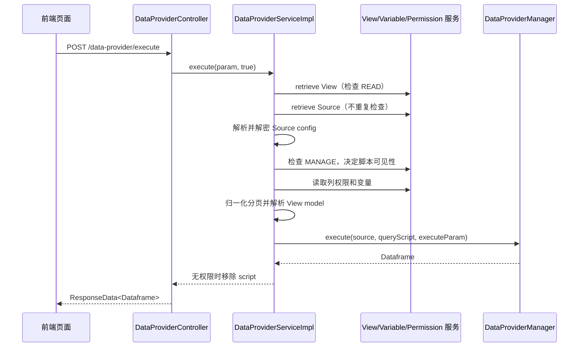
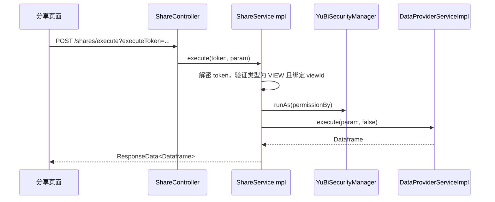

# Query 当前架构审查

> 审查日期：2026-07-12
> 对应计划：`docs/agent-ready-architecture-plan.md` 目标 A
> 审查范围：查询执行、预览执行、分享执行、权限、变量、分页、Provider 调度和前端请求构建

## 1. 结论

现有查询链路能够工作，但查询能力没有独立边界。`DataProviderServiceImpl` 同时负责实体读取、数据源配置解密、权限判定、变量解析、列权限、分页、Schema 兼容解析、Provider 调度和结果脱敏；`ShareServiceImpl` 另外负责共享令牌校验和身份切换。前端则在多个 Page thunk 和公共工具中直接拼装并发送同一查询请求。

目标 B 应提取纯 Java Query 能力模块，由 `server` 适配现有实体、Spring Security、MyBatis、AES/Jackson 和 DataProvider。当前行为已经由目标 A 特征测试锁定，迁移不能通过改变权限或删除兼容解析来换取更简单的实现。

## 2. 主要发现

| 优先级 | 发现 | 影响 | 目标处理 |
|---|---|---|---|
| P1 | `DataProviderServiceImpl` 混合查询应用逻辑与基础设施 | 无法作为 Agent Tool 的稳定能力边界，单元测试困难 | 目标 B 抽取 Query Use Case 和端口 |
| P1 | 分享查询通过 `runAs` 改写线程本地安全上下文，执行方法本身没有显式释放 | 生命周期依赖请求结束清理，后续进程内 Tool 调用风险更高 | 目标 B 的分享适配器使用受控作用域和 `finally` 清理 |
| P1 | 权限、变量和列权限在调用 Provider 前动态组装 | 任何迁移偏差都可能造成越权或数据范围变化 | 目标 A 特征测试锁定，目标 B 保持语义 |
| P2 | `ViewExecuteParam` 同时携带查询和下载/可视化字段 | 查询契约职责不清，Agent Schema 会暴露无关字段 | 目标 B 定义纯 Query 命令，目标 C 定义新 REST DTO |
| P2 | 前端共有 15 个旧查询 URL 直接调用点 | 接口迁移容易遗漏，页面之间继续共享内部类型 | 目标 C 统一到 `features/query` |
| P2 | 前端使用 `concurrencyControlMode`，后端字段为未读取的 `concurrencyControlModel` | 当前模式值没有进入执行参数 | 目标 D 删除旧拼写；在此之前不宣称该模式生效 |
| P2 | Provider 异常未经查询层分类直接向上传播 | REST、任务和未来 Agent 难以稳定处理失败 | 目标 B 在 Query 边界分类，同时保留原始 cause |
| P3 | `core` 同时包含实体、Mapper、Web、Quartz、POI、Selenium 等依赖 | 直接依赖 `core` 会把框架和基础设施传入 Query | ADR 决定 Query 不依赖 `core` |

## 3. 当前入口和消费者

服务端 API 前缀由 `yubi.server.path-prefix=/api/v1` 提供。查询相关入口为：

| 场景 | 当前入口 | 服务调用 |
|---|---|---|
| 登录用户执行 View | `POST /api/v1/data-provider/execute` | `DataProviderService.execute(param, true)` |
| 数据视图预览 | `POST /api/v1/data-provider/execute/test` | `DataProviderService.testExecute(param)` |
| 分享执行 View | `POST /api/v1/shares/execute?executeToken=...` | `ShareService.execute` → `DataProviderService.execute(param, false)` |

前端当前有 15 个 `data-provider/execute` 或 `shares/execute` 直接调用点，分布在：

- `app/utils/fetch.ts`
- `ChartWorkbenchPage/slice/thunks.ts`
- `DashBoardPage` 的 Board、BoardEditor 和 action 链路
- `MainPage` 的 ViewPage、VizPage 链路
- `SharePage/slice/thunks.ts`

`ChartDataRequestBuilder` 位于 `app/models`，请求类型位于 `app/types`，而 `ChartDataSet` 的分页类型又反向引用 ViewPage 的 slice 类型。当前没有统一的 Query Feature。

## 4. 当前数据流

### 4.1 登录查询



已确认行为：

- View 按 `checkPermission=true` 读取，Source 按 `false` 读取。
- `MANAGE` 权限只控制脚本是否返回，不替代 View 的 `READ` 检查。
- 非组织 Owner 从 `rel_subject_columns` 合并当前用户角色的列权限。
- 组织 Owner 使用通配列 `*`，并禁用所有权限变量。
- 系统变量包括当前用户的名称、邮箱、ID 和用户名。
- 请求参数覆盖同名 Query 变量；无请求值且变量是表达式时转为 `FRAGMENT`。
- 缺失分页默认为第 1 页、1000 行；非法页码归一为 1，页大小上限为 `Integer.MAX_VALUE`。
- Provider 返回的脚本只在请求显式要求且当前用户具有 `MANAGE` 权限时保留。
- Provider 异常当前不翻译，原异常向上传播。

### 4.2 分享查询



分享令牌必须绑定请求中的 `viewId`，否则拒绝执行。校验成功后以令牌的 `permissionBy` 身份运行，并跳过 View 的入口 READ 检查；后续变量、列权限和脚本可见性仍基于切换后的身份计算。

当前 `ShareServiceImpl.execute` 没有在方法内调用 `releaseRunAs()`。这不是目标 A 的生产修复范围，但目标 B 的适配器必须把身份切换限制在显式作用域内，避免未来 Agent 进程内调用复用被切换的安全上下文。

### 4.3 预览查询

预览入口按 `sourceId` 读取 Source 并检查权限，合并系统、组织和请求变量，将表达式变量标记为 `FRAGMENT`，使用固定第 1 页和请求 `size`（最小为 1），关闭缓存并允许全部列。该入口服务数据视图编辑器，不应暴露为 Agent V1 任意 SQL 工具。

## 5. 当前请求与响应契约

登录和分享执行当前共用 `ViewExecuteParam`。典型请求如下：

```json
{
  "viewId": "view-1",
  "columns": [{ "alias": "amount", "column": ["orders", "amount"] }],
  "aggregators": [],
  "filters": [],
  "groups": [],
  "orders": [],
  "pageInfo": { "pageNo": 1, "pageSize": 1000, "countTotal": false },
  "params": { "status": ["paid"] },
  "concurrencyControl": false,
  "cache": false,
  "cacheExpires": 0,
  "script": false
}
```

只有 `columns`、`aggregators`、`groups` 参与空查询判断。`vizId`、`vizName` 和 `vizType` 还被下载/附件服务使用，不属于纯查询命令。前端发送 `concurrencyControlMode`，当前后端只声明 `concurrencyControlModel` 且查询实现没有读取它。

响应为统一包装：

```json
{
  "success": true,
  "errCode": 0,
  "data": {
    "id": "DF...",
    "columns": [{ "name": ["orders", "amount"], "type": "NUMERIC" }],
    "rows": [[120]],
    "pageInfo": { "pageNo": 1, "pageSize": 1000, "total": 1 },
    "script": null
  }
}
```

## 6. 持久化兼容边界

数据库中的 View `config` 和 Dashboard/Chart 配置包含查询设置，前端迁移代码与测试已经覆盖多个历史版本。目标 B–D 必须保留：

- View 和 Dashboard 配置的 JSON 结构及版本迁移。
- `concurrencyControlMode`、`cache`、`cacheExpires` 等已保存配置字段。
- View `model` 的三种 Schema 形态：`columns`、`hierarchy` 和 beta.1 以前的扁平结构。
- DataProvider SPI 及其 `QueryScript`、`ExecuteParam` 适配语义。

可以删除的是未被持久化使用的后端拼写 `concurrencyControlModel`，但只能在新 REST DTO 和前端迁移完成后的目标 D 执行。

## 7. 目标 A 测试基线

新增测试：

| 测试 | 锁定行为 |
|---|---|
| `DataProviderServiceImplCharacterizationTest` | 登录与预览查询、系统/组织/View 变量、请求覆盖、列权限、Owner 通配、分页、脚本隐藏、Provider 异常 |
| `ShareServiceImplCharacterizationTest` | 分享令牌绑定 View、`runAs` 身份、调用 `execute(param, false)`、错误 View 拒绝 |

目标 A 不修改生产代码，也不创建 `query` 模块。Query 模块的最终边界和公开契约由 [ADR-0001](./adr/0001-query-capability-boundary.md) 固化。
